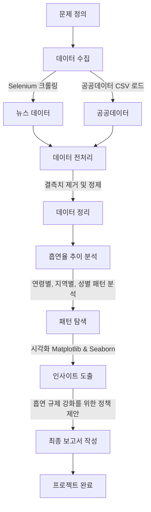

# 연기의 민족 (SmokeNation)

## 최종 PPT링크
https://www.canva.com/design/DAGacERlqqU/VLw600U8s9SdePvBxtOO1g/edit?utm_content=DAGacERlqqU&utm_campaign=designshare&utm_medium=link2&utm_source=sharebutton

## 프로젝트 소개 (Introduction)

**"연기의 민족"** 프로젝트는 청소년 흡연의 실태를 조사하고 데이터를 분석하여 규제 방안을 제안하는 프로젝트입니다. 
웹 크롤링과 공공 데이터를 활용하여 데이터를 수집하고, Python 기반의 데이터 분석을 통해 의미 있는 인사이트를 도출하였습니다.

## 프로젝트 목표 (Objectives)
- **청소년 흡연 실태**를 데이터 기반으로 분석
- **청소년 흡연 패턴** 및 주요 원인 도출
- **효과적인 규제 방안** 제안으로 정책 수립 기여

## 데이터 수집 (Data Collection)

### 웹 크롤링 (Web Crawling)
- **Selenium**을 활용하여 네이버에서 최근 3년간(1,874건)의 뉴스 기사를 크롤링하였습니다.

### 공공 데이터 (Public Data)
- **질병관리청**에서 제공하는 공공 데이터를 활용하여 청소년 흡연율을 분석하였습니다.

## 데이터 분석 (Data Analysis)

### 사용한 기술
- **Python**: 데이터 처리 및 분석
- **Pandas, NumPy**: 데이터 정제 및 가공
- **Matplotlib, Seaborn, Wordcloud**: 데이터 시각화
- **Konlpy**: 데이터 형태소 분석
- **Open API**: 뉴스 데이터 수집

### 분석 과정
1. **일반 담배와 전자담배의 흡연율 추이 분석**
2. **공공데이터(CSV) 및 웹 크롤링을 활용한 데이터 수집**
3. **결측치 제거 및 불필요한 속성 정리 → 새로운 인사이트 도출**
4. **시각화(Matplotlib, Seaborn, Wordcloud)를 통한 데이터 분석**
5. **흡연 규제 강화를 위한 정책 제안**

## 결과 및 인사이트 (Results & Insights)
- **청소년 흡연의 주요 원인 분석**
- **연령별, 지역별, 성별 흡연 패턴 도출**
- **흡연 규제 강화를 위한 구매 절차 강화 및 AI기반 안면 인식 시스템 도입 제안**


## 이슈 해결 및 개선 사항
### 1. 이슈 해결
시각화 한글 폰트 깨짐 오류
1. 내가 가진 폰트 확인하기
```
# 내가 가지고 있는 폰트 목록 확인하기
from matplotlib import font_manager

search_font = "gothic"    # 필터

for font in font_manager.findSystemFonts():
  font_info = font_manager.FontProperties(fname=font)
  font_name = font_info.get_name()
  font_path = font_info.get_file()
  if search_font in font_name.lower():
    print(font_name, font_path)

## 출력 예시
# NanumGothic Eco /usr/share/fonts/truetype/nanum/NanumGothicEcoExtraBold.ttf
# NanumBarunGothic /usr/share/fonts/truetype/nanum/NanumBarunGothicLight.ttf
# NanumGothicCoding /usr/share/fonts/truetype/nanum/NanumGothicCoding.ttf
```
2. Matplotlib에 내 폰트 등록하기
1번에서 URL을 복사하여 font_path에 넣는다.
```
# 폰트 등록하기 
from matplotlib import font_manager 

## 폰트 경로
font_path = "/usr/share/fonts/truetype/nanum/NanumGothicCodingBold.ttf"
## 폰트 추가
font_manager.fontManager.addfont(font_path)
## 폰트 이름 확인
font_name = font_manager.FontProperties(fname=font_path).get_name()
print(font_name)
```
3. Font Family 설정하기
2번의 font_name과 동일하게 작성한다.
```
# 폰트 설정하기
font_name = "NanumGothic Eco"

## 방법1
# plt.rc('font', family=font_name)
## 방법2
plt.rcParams["font.family"] = font_name
```
### 2. 개선 사항
데이터 수집 과정에서 최신 데이터 부족으로 일부 보완 필요 특정 연령대의 흡연율 변화 요인 분석이 더 심층적으로 이루어 졌다면 좋았을 것 같다.

## 사용 방법 (How to Use)
### 1. Jupyter Notebook 실행
```bash
jupyter notebook
```
### 2. 데이터 크롤링 실행
```bash
python crawler.py
```
### 3. 분석 코드 실행 후 결과 확인
